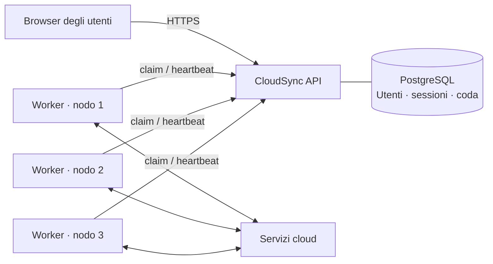

<div align="center">

# ◈ CloudSync

### Il tuo cloud, in movimento.

**Account personali · Trasferimenti persistenti · Worker distribuiti**

[Inizia](#un-solo-comando) · [Guida utente](docs/USER_GUIDE.md) · [Proxmox e nodi](docs/DEPLOYMENT.md) · [Architettura](docs/ARCHITECTURE.md) · [Verifiche](docs/TESTING.md)

</div>


CloudSync dà un'interfaccia web a **Rclone**. Ogni utente collega i propri servizi, esplora cartelle e avvia copie o spostamenti. Il server continua a lavorare quando il browser viene chiuso. Più worker condividono una coda PostgreSQL e si dividono il lavoro.

> **Versione 0.2 — ricostruzione completa.** Il vecchio programma rimane nella cronologia Git. Questa versione non importa automaticamente i suoi account, token o dati condivisi.

## Un solo comando

```bash
./start
```

- **Mac o server con Docker Compose:** costruisce e avvia database, API e worker; apre il servizio su `http://127.0.0.1:8080`.
- **Container Linux dedicato, root e senza Docker:** installa la versione nativa con systemd.
- **Installazione nativa già presente:** avvia i servizi e verifica la salute, senza interrompere quelli già attivi.
- **LXC con Docker già installato:** il primo avvio nativo è `./start native`; da quel momento basta `./start`.

Al primo avvio vengono generati i segreti e l'account `admin`. La password si trova in `.env` per Docker, oppure `/etc/cloudsync/server.env` per l'installazione nativa. Non viene stampata nei log. Ogni amico può registrarsi con **nome e password**, senza email né requisiti di complessità.

## Cosa puoi fare

| Spazio personale | Servizio sempre attivo | Gestione del cluster |
| --- | --- | --- |
| Nome e password, cookie di sessione | Coda su PostgreSQL | Aggiunta e revoca dei nodi |
| Collegamenti cloud separati | Copia e spostamento con Rclone | Peso di banda per utente |
| Esplorazione a due pannelli | Annullamento e nuovi tentativi | Limiti globali, per utente e nodo |
| Cronologia dei trasferimenti | Copie periodiche senza sovrapposizioni | Massimo di lavori contemporanei |
| Layout desktop e mobile | Recupero dei lavori dopo perdita del worker | Worker collegati via HTTP(S) |

## Provider della prima versione

| Provider | Collegamento | Stato del percorso di autenticazione |
| --- | --- | --- |
| S3 compatibile | Access key, secret, regione/endpoint | Implementato |
| WebDAV / Nextcloud | URL HTTPS, nome e password | Implementato |
| SFTP | Host, utente, password; chiave host verificata dall'amministratore | Implementato |
| Google Drive | Token JSON di `rclone authorize drive` | Implementato; login OAuth web diretto non incluso |
| iCloud Drive | Password Apple, 2FA e backend `iclouddrive` | Procedura guidata implementata; accesso Apple reale da collaudare |

L'implementazione di un provider non equivale a una verifica sul tuo account. I test automatici eseguono copie reali con Rclone su dati temporanei; il collaudo cloud richiede account di prova. I provider personalizzati sono limitati a endpoint pubblici; i servizi LAN richiedono una politica di rete dedicata prima di essere abilitati.

## Come si distribuisce



I worker non richiedono un filesystem condiviso. Ricevono solo la configurazione necessaria al lavoro assegnato. Il contenuto dei file passa direttamente fra il processo Rclone e i provider; normalmente un trasferimento fra cloud diversi utilizza la connessione del nodo.

**Distribuito non significa automaticamente alta disponibilità:** nella topologia base PostgreSQL e API restano centrali. I worker possono essere aggiunti su altri container o macchine. Il failover di PostgreSQL non è incluso.

## Qualità verificabile

```bash
uv sync --frozen
uv run pytest -q
uv run ruff check cloudsync tests
uv run python tests/ui_check.py
```

Il test browser richiede Google Chrome. Il test di concorrenza richiede `TEST_DATABASE_URL` verso un database PostgreSQL dedicato. Vedi [risultati, comandi e limiti dei test](docs/TESTING.md).

## Mappa del progetto

```text
cloudsync/      API, dati, sicurezza, scheduler, worker Rclone
frontend/       Interfaccia senza CDN, asset serviti localmente
start           Punto di ingresso unico
compose*.yaml   Server completo e worker aggiuntivi
deploy/        Installazione LXC e unità systemd
tests/         Isolamento, lease, concorrenza, copie vere, browser
docs/          Guide operative, architettura e verifica
```

## Documentazione

- [Guida utente](docs/USER_GUIDE.md): collegare, esplorare, trasferire e pianificare.
- [Distribuzione](docs/DEPLOYMENT.md): LXC, Docker, HTTPS, nodi aggiuntivi.
- [Architettura](docs/ARCHITECTURE.md): banda, equità, lease e limiti del sistema.
- [Operazioni](docs/OPERATIONS.md): backup, ripristino, aggiornamenti e diagnosi.
- [Verifiche](docs/TESTING.md): cosa è stato provato e cosa resta da collaudare.

Costruito su [Rclone](https://rclone.org/), [FastAPI](https://fastapi.tiangolo.com/) e [PostgreSQL](https://www.postgresql.org/).
