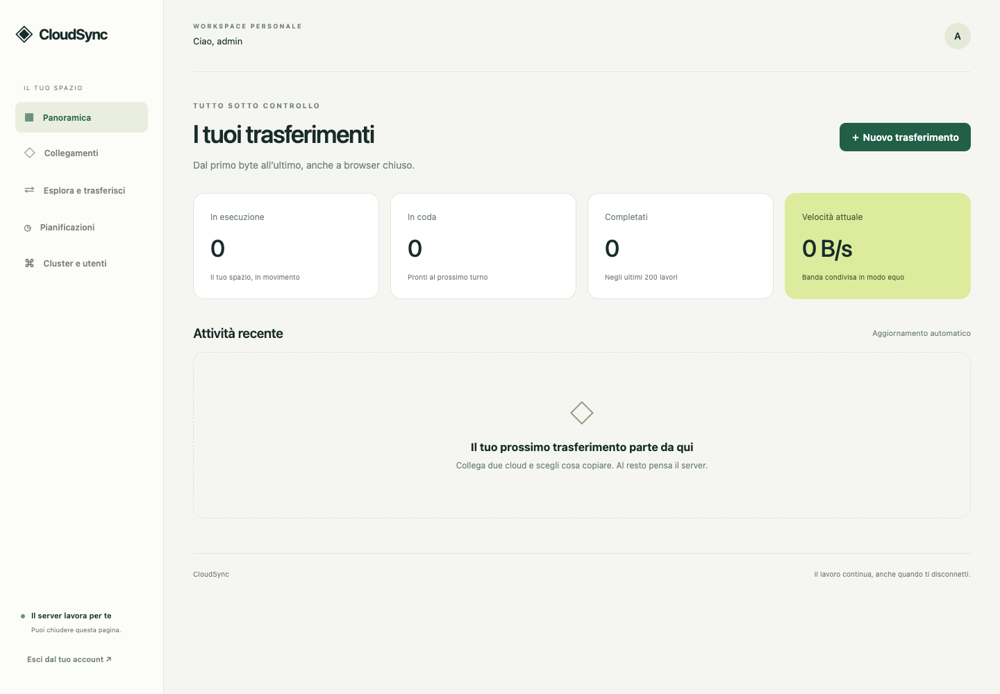

<div align="center">

# ◈ CloudSync

### Enterprise-Grade Distributed Cloud Migration & Storage Orchestration

**Multi-Cloud Transfers · Persistent Job Queue · Distributed Worker Nodes · Live Hot-Migration**

[](https://www.python.org/)
[](https://fastapi.tiangolo.com/)
[](https://www.postgresql.org/)
[](https://rclone.org/)
[](tests/)
[](https://github.com/astral-sh/ruff)
[](LICENSE)

[Quick Start](#-quick-start) • [Features](#-features) • [Cluster Architecture](#-cluster-architecture) • [Worker Node TUI](#-worker-node-tui-dashboard) • [Supported Providers](#-supported-providers) • [Documentation](#-documentation)

---

</div>



**CloudSync** transforms [Rclone](https://rclone.org/) into a distributed, multi-user cloud migration and synchronization powerhouse. 

Connect cloud accounts, explore files across multiple providers simultaneously, and launch resilient background copy/move/sync operations. Your transfers persist and execute reliably 24/7 without keeping your browser window open. Distribute transfer loads across any number of worker nodes (local containers, workstations, or remote VPSs) with automatic failover, real-time hot migration, and cumulative checkpointing.

---

## ⚡ Key Highlights & Features

### 🎨 Modern Dark Glassmorphic UI
- **Zero-Dependency Native Frontend:** Built with vanilla ES6+ and modern CSS with glassmorphic cards and subtle gradients. Zero external JavaScript frameworks, zero CDNs, and strict CSP compliance.
- **Real-Time Speed Chart:** Hardware-accelerated local Canvas telemetry tracking instantaneous cluster throughput over time.
- **Dual-Pane File Explorer:** Interactive side-by-side browser to browse remote directory trees, navigate folders, create directories, and delete files directly.
- **Persistent Session State:** Transfers continue unaffected when you log out, close the tab, or shut down your personal device.

### 🌐 Distributed Multi-Node Clustering
- **Decentralized Data Pipes:** Worker nodes connect securely to the central API via HTTP/HTTPS (LAN or public Cloudflare Tunnels). Cloud-to-cloud file transfers flow directly through the worker node without hair-pinning through the central server.
- **Terminal TUI Dashboard:** External workers feature a full-screen, interactive terminal monitor (`node_dashboard.py`) built with Rich, displaying slot utilization, bandwidth meters, active jobs, and historical transfers.
- **Heterogeneous Workers:** Run workers anywhere — Debian/Ubuntu LXC, Proxmox, Docker, macOS workstations, Raspberry Pi, or bare-metal servers.

### 🔄 Live Hot-Migration & Checkpointing
- **Zero-Downtime Node Migration:** Reassign active transfer jobs dynamically from the Admin dashboard ("Sposta nodo ⇄") without interrupting the overall transfer.
- **Cumulative Checkpointing:** Transferred bytes are tracked incrementally. When a job switches nodes, progress bars seamlessly continue forward instead of resetting to 0%.
- **Instant Resume (`--check-first`):** Resumed jobs automatically verify and skip already-transferred files before beginning remaining data streams.

### 🛡️ Self-Healing Fault Tolerance
- **Instant Failover:** If an external worker node terminates unexpectedly or is stopped via `Ctrl + C`, in-flight jobs are released gracefully back into the queue without failure flags or penalty delays.
- **Background Watchdog:** A dedicated control plane watchdog continuously monitors worker heartbeats, automatically detects offline nodes, unpins stuck jobs, and dispatches them to the next available worker.
- **Weighted Fair-Share Scheduling:** Dynamic bandwidth allocation and fair job rotation prevent one heavy transfer from starving other users or nodes.

### 🔁 Continuous & Bidirectional Cloud Folder Synchronization
- **Always-On Background Sync:** Keep two folders continuously synchronized across different cloud providers, completely unattended in the background even when your browser is closed.
- **2-Way Bidirectional Sync (`bisync` ⇄):** Additions, modifications, and deletions made on either provider automatically replicate to the other provider with conflict resolution and self-healing auto-resync.
- **1-Way Mirror Sync (`sync` ➔):** Keep the destination folder an exact mirror of the source, copying new files and automatically deleting destination files removed from the source.
- **Continuous Polling Intervals:** Selectable continuous check intervals starting from 30 seconds (always-on loop) up to hourly schedules.
- **Management Controls:** Dedicated "Sincronizzazioni" dashboard offering immediate manual triggers ("Sincronizza ora"), pause/resume toggling, and removal.

### 🔑 Frictionless Cloud Authentication
- **1-Click Google Drive Pairing:** Native local helper daemon (`scripts/google_helper.py`) pairs Google Drive accounts via an ephemeral local callback listener (`127.0.0.1:53683`), eliminating cumbersome token pasting.
- **Apple iCloud Drive (with 2FA):** Native support for Apple ID login, trusted device 2FA challenge responses, and session persistence.
- **Zero Plaintext Credentials:** Cloud tokens and access keys are symmetrically encrypted at rest using AES-128-CBC / Fernet (`cryptography`).

---

## 🏗️ Cluster Architecture

```text
                             ┌─────────────────────────────────┐
                             │       Web Browser Client        │
                             │  (Dark Glassmorphic UI Canvas)  │
                             └────────────────┬────────────────┘
                                              │ HTTPS / WSS
                                              ▼
   ┌─────────────────────────────────────────────────────────────────────────────┐
   │                     CloudSync Control Plane (FastAPI)                       │
   │  ┌─────────────────────┐  ┌─────────────────────┐  ┌─────────────────────┐  │
   │  │ Auth & Secret Vault │  │ Scheduler & Queue   │  │ Failover Watchdog   │  │
   │  │ (Fernet Encryption) │  │ (Weighted Fair Q)   │  │ (Lease Management)  │  │
   │  └─────────────────────┘  └─────────────────────┘  └─────────────────────┘  │
   └──────────────────────┬───────────────────────────────┬──────────────────────┘
                          │                               │
            State & Queue │                  Heartbeats & │ Job Leases
                          ▼                               ▼
              ┌───────────────────────┐       ┌───────────────────────┐
              │  PostgreSQL Database  │       │ Worker Cluster Nodes  │
              └───────────────────────┘       └───────────┬───────────┘
                                                          │
                  ┌───────────────────────────────────────┼───────────────────────────────────────┐
                  ▼                                       ▼                                       ▼
      ┌───────────────────────┐               ┌───────────────────────┐               ┌───────────────────────┐
      │ Primary Server Worker │               │ macOS Workstation     │               │ Remote VPS / Server   │
      │ (Local LXC / Docker)  │               │ (Interactive TUI)     │               │ (Headless Worker)     │
      └───────────┬───────────┘               └───────────┬───────────┘               └───────────┬───────────┘
                  │                                       │                                       │
                  └───────────────────────────────────────┼───────────────────────────────────────┘
                                                          │ Direct Rclone Transfer Streams
                                                          ▼
                                 ┌─────────────────────────────────────────────────┐
                                 │       Cloud Providers & Storage Endpoints       │
                                 │   Google Drive · iCloud · S3 · WebDAV · SFTP    │
                                 └─────────────────────────────────────────────────┘
```

---

## 🖥️ Worker Node TUI Dashboard

External worker nodes come equipped with an interactive, full-screen terminal dashboard:

```text
 ╭──────────────────────────── CloudSync Node: mac-stocca ────────────────────────────╮
 │ API: https://sync.example.com [1.8 ms]                     Uptime: 01h 42m 15s     │
 ╰────────────────────────────────────────────────────────────────────────────────────╯
 ╭─ Worker Slots ───────────╮ ╭─ Node Bandwidth ─────────╮ ╭─ Telemetry ──────────────╮
 │ [████████░░░░░░░░] 2/4   │ │ [████████████░░░] 68.4%  │ │ Transferred: 14.8 GiB    │
 │ Active Workers: 50.0%    │ │ 34.2 MiB/s / 50.0 MiB/s  │ │ Completed: 12 | Failed: 0│
 ╰──────────────────────────╯ ╰──────────────────────────╯ ╰──────────────────────────╯
 ┏━━━━┳━━━━━━┳━━━━━━━━━━━━━━━━━━━━━━━━━━━━━━━━┳━━━━━━━━━━━━━━━━━━┳━━━━━━━━━━┳━━━━━━━━┓
 ┃ ID ┃ Type ┃ Source ➔ Destination           ┃ Progress         ┃ Speed    ┃ ETA    ┃
 ┡━━━━╇━━━━━━╇━━━━━━━━━━━━━━━━━━━━━━━━━━━━━━━━╇━━━━━━━━━━━━━━━━━━╇━━━━━━━━━━╇━━━━━━━━┩
 │ 42 │ COPY │ gdrive:Photos ➔ icloud:Backup  │ [████████░░] 82% │ 18.5MB/s │ 01m 24s│
 │ 43 │ MOVE │ s3:datasets ➔ webdav:Archive   │ [████░░░░░░] 41% │ 15.7MB/s │ 03m 10s│
 └────┴──────┴────────────────────────────────┴──────────────────┴──────────┴────────┘
 ╭─ Recent History ───────────────────────────────────────────────────────────────────╮
 │ ✔ Job #41  gdrive:Videos ➔ local:NAS         1.2 GiB  [00m 45s]       COMPLETED    │
 │ ✔ Job #40  s3:backups ➔ webdav:Storage       450 MiB  [00m 18s]       COMPLETED    │
 ╰────────────────────────────────────────────────────────────────────────────────────╯
```

---

## 🚀 Quick Start

### Option 1: Automatic Bootstrap (Recommended)

CloudSync includes a smart, single-command launcher that detects your environment:

```bash
./start
```

- **macOS / Docker Server:** Automatically builds and spins up PostgreSQL, the FastAPI control plane, and a worker container via Docker Compose.
- **Dedicated Linux / LXC Container:** Installs native systemd units, initializes PostgreSQL, generates secure cryptographic secrets, and brings up the services.
- **Access the Dashboard:** Open `http://localhost:8080` in your browser.

> **Credentials:** Administrator credentials (`admin`) and cryptographic keys are generated on first boot and written securely to `.env` (Docker) or `/etc/cloudsync/server.env` (systemd).

---

### Option 2: Docker & Docker Compose

CloudSync offre tre modalità di deployment Docker per adattarsi a qualsiasi esigenza infrastrutturale:

#### A) Modalità Standard Multi-Container (PostgreSQL + API + Worker)
Ideale per installazioni su server di produzione dedicati con database PostgreSQL ad alta affidabilità e worker scalabili:

1. **Clona il repository e prepara l'ambiente:**
   ```bash
   git clone https://github.com/Stocca05/CloudSync.git
   cd CloudSync
   cp .env.example .env
   # Modifica le password e le chiavi segrete in .env (oppure lancia ./start per generarle in automatico)
   nano .env
   ```

2. **Avvia il cluster:**
   ```bash
   docker compose up -d --build
   ```

3. **Come funziona l'architettura dei servizi (`compose.yaml`):**
   - **`db`** (`postgres:17.9`): database relazionale con lock advisory transazionali e volume persistente `database:/var/lib/postgresql/data`.
   - **`api`** (`cloudsync:0.2.0`): server FastAPI + interfaccia Web Glassmorphic esposta su `http://localhost:8080`.
   - **`worker`** (`cloudsync:0.2.0`): processo worker non-root isolato che preleva i job dalla coda ed esegue i flussi Rclone.

---

#### B) Modalità All-in-One Super Leggera (1 Solo Container con SQLite)
Ideale per **NAS (Synology, QNAP, Unraid, TrueNAS)**, mini-PC o uso personale a **bassissimo consumo di RAM (~80-120 MB)**, senza bisogno di un database PostgreSQL esterno:

- **Avvio rapido con Docker Compose (`compose.aio.yaml`):**
  ```bash
  docker compose -f compose.aio.yaml up -d
  ```

- **Oppure con singolo comando `docker run`:**
  ```bash
  docker run -d \
    --name cloudsync \
    -p 8080:8000 \
    -v cloudsync-data:/data \
    --restart unless-stopped \
    cloudsync:latest
  ```

> 💡 **Zero Configurazione Necessaria:** Al primo avvio, il supervisore interno genera automaticamente la chiave di crittografia (`/data/cloudsync.key`), il database SQLite con modalità WAL ad alte prestazioni (`/data/cloudsync.db`) e una password iniziale per l'utente `admin`. La password viene mostrata nei log (`docker logs cloudsync`) e salvata in modo sicuro in `/data/admin.password`.

---

#### C) Modalità Worker Docker Distribuito (Aggiungere Nodi al Cluster)
Se hai già un server centrale CloudSync attivo e vuoi aggiungere un altro computer, workstation o VPS come nodo di calcolo remoto:

```bash
docker compose -f compose.worker.yaml up -d
```
*(È sufficiente specificare nel file `compose.worker.yaml` l'indirizzo del server centrale `CONTROL_URL` e il token di autenticazione `WORKER_TOKEN`).*

---

#### 🛠️ Comandi Utili per la Gestione Docker

| Operazione | Comando Docker Compose | Comando Container Singolo |
| :--- | :--- | :--- |
| **Visualizzare i log in tempo reale** | `docker compose logs -f` | `docker logs -f cloudsync` |
| **Verificare lo stato dei container** | `docker compose ps` | `docker ps` |
| **Riavviare i servizi** | `docker compose restart` | `docker restart cloudsync` |
| **Fermare l'applicazione** | `docker compose down` | `docker stop cloudsync` |
| **Aggiornare alla versione più recente** | `git pull && docker compose up -d --build` | `docker pull ... && docker restart ...` |

---

### Option 3: Adding an External Worker Node

Scale your cluster by running a worker on another computer:

```bash
cd worker-node

# Configure node parameters
cp .env.example .env
nano .env

# Launch interactive worker
./start_node.sh
```

---

## ☁️ Supported Providers

| Provider | Authentication Flow | Operations | Status |
| :--- | :--- | :--- | :---: |
| **Google Drive** | 1-Click pairing helper (`google_helper.py`) or token | Copy, Move, Mkdir, Delete, Sync | ✅ Production |
| **Apple iCloud Drive** | Apple ID password + Interactive 2FA challenge | Copy, Move, Mkdir, Delete, Sync | ✅ Production |
| **Amazon S3 / MinIO** | Access Key, Secret Key, Region & Endpoint | Copy, Move, Mkdir, Delete, Sync | ✅ Production |
| **WebDAV / Nextcloud** | HTTPS Endpoint, Username & Password | Copy, Move, Mkdir, Delete, Sync | ✅ Production |
| **SFTP** | Host, Port, Username, Password / Key | Copy, Move, Mkdir, Delete, Sync | ✅ Production |

---

## 🔒 Security & Privacy

- **Encrypted at Rest:** All sensitive cloud tokens, refresh tokens, and passwords are encrypted using Fernet symmetric encryption (`cryptography`) before storage in PostgreSQL.
- **Isolated Transfer Contexts:** Worker nodes only receive ephemeral, decrypted credentials for active jobs in isolated temporary directories that are wiped immediately upon task completion.
- **No Shared Disk Exposure:** Worker nodes never require shared NFS/SMB mounts. File transfers stream directly from cloud provider to cloud provider in memory/temporary buffers.
- **Strict Content Security Policy (CSP):** The web UI operates with strict CSP rules preventing script injection or unapproved external connections.

---

## 🧪 Testing & Verification

The CloudSync test suite covers concurrent scheduling, fair queuing, lease renewal, real Rclone transfers, Google/iCloud authentication flows, and failure recovery:

```bash
# Run the complete test suite
uv run pytest -v

# Run linting and style verification
uv run ruff check cloudsync tests
```

---

## 📂 Repository Structure

```text
├── cloudsync/              # Core backend application
│   ├── api.py              # FastAPI REST endpoints & WebSocket control
│   ├── google_auth.py      # Google OAuth 1-click helper flow
│   ├── icloud_auth.py      # Apple iCloud 2FA negotiation
│   ├── models.py           # SQLAlchemy database schemas
│   ├── providers.py        # Cloud provider definitions & path validators
│   ├── scheduler.py        # Fair-share queue scheduler & watchdog
│   ├── security.py         # Passwords, hashing & Fernet vault
│   ├── settings.py         # Configuration settings
│   └── worker.py           # Core Rclone execution engine
├── frontend/               # Zero-dependency web interface
│   ├── app.js              # State management & reactive UI logic
│   ├── index.html          # Semantic HTML shell
│   └── styles.css          # Dark glassmorphism theme & canvas chart styles
├── worker-node/            # External worker node package
│   ├── node_dashboard.py   # Full-screen Rich TUI worker daemon
│   ├── start_node.sh       # Node startup script
│   ├── .env.example        # Worker configuration template
│   └── README.md           # Worker node setup guide
├── scripts/                # Utility scripts & auth helpers
├── deploy/                 # Systemd unit files & installer scripts
├── docs/                   # In-depth architectural & user documentation
├── tests/                  # Integration and unit tests
├── compose.yaml            # Docker Compose orchestration definition
└── start                   # Universal one-command startup script
```

---

## 📄 License

This project is licensed under the **MIT License** — see the [LICENSE](LICENSE) file for details.

---

<div align="center">

Crafted with care by **Luca Raona** and the CloudSync community.

</div>
