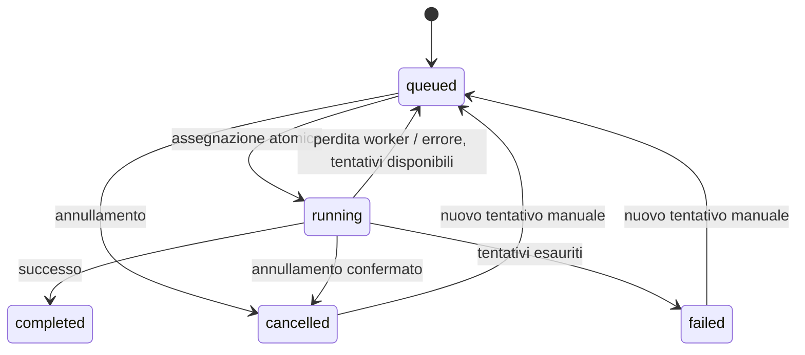

# Architettura · Un servizio, più nodi

[← Panoramica](../README.md) · [Distribuzione →](DEPLOYMENT.md)

## Confini del sistema

Il control plane contiene API, autenticazione e scheduler; PostgreSQL è la fonte autorevole. I worker sono nodi fidati amministrati dal proprietario. Non sono computer anonimi ai quali affidare credenziali.

Ogni risorsa applicativa appartiene a un utente. Le API controllano il proprietario anche quando un identificatore viene indovinato. Password hashate con scrypt, cookie HttpOnly/SameSite e sessioni revocabili. Nessuna verifica email o regola di complessità. La registrazione può essere chiusa con `ALLOW_REGISTRATION=false`.

Le configurazioni sono cifrate con Fernet. La chiave è esterna al database: è necessaria anche durante il ripristino. Il worker riceve le configurazioni del lavoro via canale autenticato e le materializza in directory temporanee private. Il processo Rclone non eredita il token di arruolamento del worker.

L'isolamento applicativo è verificato dai test. I processi Rclone sullo stesso worker usano lo stesso UID di servizio: non è un confine contro una vulnerabilità del binario Rclone. Per una separazione più forte usare worker dedicati e confinamento di rete. Non è possibile selezionare filesystem locali, alias, flag o comandi arbitrari dall'interfaccia.

## Vita di un trasferimento



Le assegnazioni avvengono dentro una breve transazione protetta da advisory lock PostgreSQL. Il test concorrente verifica assenza di doppie assegnazioni e rispetto dei limiti. Non serve eleggere un leader scheduler.

Ogni esecuzione ha un token di lease. Il worker rinnova ogni circa 3 secondi; il lease scade dopo 90 secondi. Un worker senza rinnovi si arresta entro circa 25 secondi più il timeout HTTP e il tempo di terminazione. Un token precedente non può aggiornare il lavoro dopo una riassegnazione.

I tentativi sono al massimo tre per ciclo, con attesa crescente dopo errore. Un nuovo tentativo manuale apre un nuovo ciclo. L'arresto ordinato del worker rende il lavoro ritentabile; l'annullamento esplicito dell'utente lo ferma.

**Semantica: almeno una esecuzione, non exactly-once.** Dopo crash o partizioni i file già copiati vengono rivalutati da Rclone. Non è garantita la ripresa al byte. Il fencing protegge lo stato del database, non può revocare una scrittura già inviata a un cloud. Sospensioni dell'intero host e provider non idempotenti richiedono particolare attenzione.

## Equità e banda

L'amministratore sceglie:

| Livello | Controllo |
| --- | --- |
| Cluster | Banda totale desiderata; massimo lavori attivi |
| Utente | Peso 1–10; tetto di banda facoltativo; massimo lavori attivi |
| Nodo | Banda disponibile; slot assegnabili |
| Lavoro | Priorità normale/alta/urgente dentro la coda del proprietario |

Il prossimo lavoro appartiene all'utente servito meno recentemente. A parità di utente, viene prima la priorità più alta e poi il lavoro più vecchio. Le priorità non consentono di saltare indefinitamente gli altri utenti.

Per ogni utente attivo:

```text
quota_utente = banda_cluster × peso_utente / somma_pesi_utenti_attivi
quota_utente = min(quota_utente, eventuale_tetto_utente)
quota_lavoro = min(quota_utente / lavori_utente, banda_nodo / lavori_nodo)
```

Con 30 MiB/s e pesi 2:1, due utenti ottengono target 20 e 10 MiB/s. Se il primo apre due lavori, ognuno riceve 10 MiB/s: la sua quota totale non raddoppia.

Il worker applica i target con `core/bwlimit` di Rclone. Gli aggiornamenti convergono sui successivi heartbeat: **non è un limite istantaneo di rete**. Aperture/chiusure di lavori possono provocare brevi superamenti. I limiti Rclone sono in byte al secondo, mentre la connessione viene spesso venduta in bit al secondo. Per un tetto fisico rigido, applicare traffic shaping sulla rete Proxmox.

La quota inutilizzata da un utente limitato o da un provider lento non viene ancora redistribuita automaticamente. Non c'è preemption di un trasferimento già attivo.

## Pianificazioni

Le pianificazioni persistono in PostgreSQL e vengono valutate durante il polling dei worker. La stessa pianificazione non genera un'altra esecuzione finché la precedente è in coda o attiva. Dopo un periodo offline viene creata una sola esecuzione, senza recuperare ogni intervallo perso.

Sono consentite solo copie periodiche. Lo spostamento resta una scelta esplicita per singolo lavoro.

## Limiti operativi iniziali

- Massimo 200 lavori pendenti per utente e 20 pianificazioni.
- Esplorazione: primi 1.000 elementi, output massimo 8 MB.
- Fino a 256 lavori attivi configurabili, da dimensionare sull'hardware reale.
- Configurazioni cloud: 30 collegamenti per utente.
- Cronologia UI: ultimi 200 trasferimenti; database senza eliminazione automatica dei lavori.
- Non sono implementati bisync, pause riprendibili, deduplicazione globale o storage distribuito dei file.
- L'aggiunta di worker scala i trasferimenti; non replica da sola PostgreSQL.

## Riferimenti

[Rclone Remote Control](https://rclone.org/rc/) · [Rclone copy](https://rclone.org/commands/rclone_copy/) · [PostgreSQL advisory locks](https://www.postgresql.org/docs/current/explicit-locking.html#ADVISORY-LOCKS)
